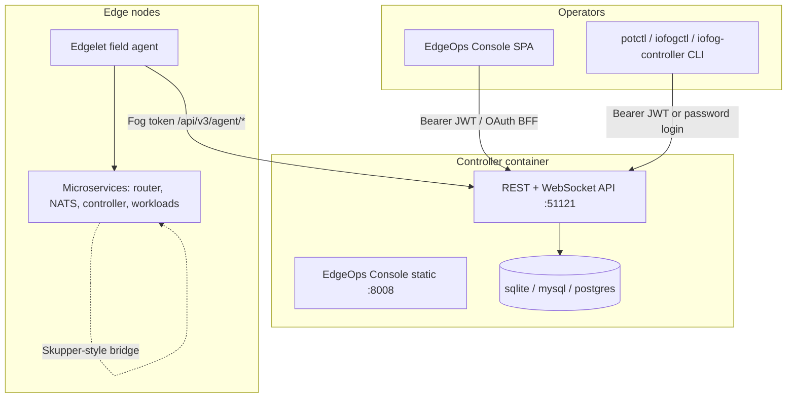
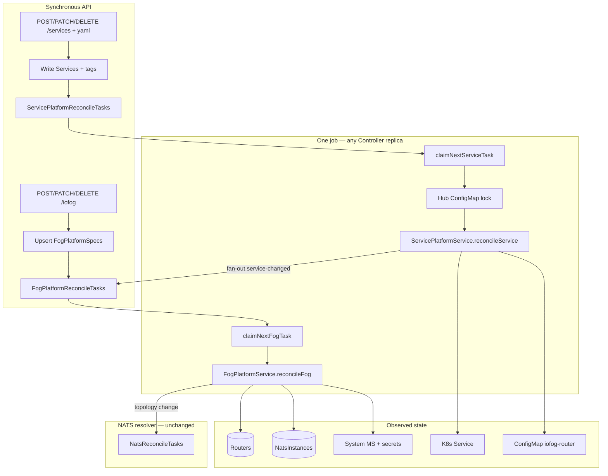
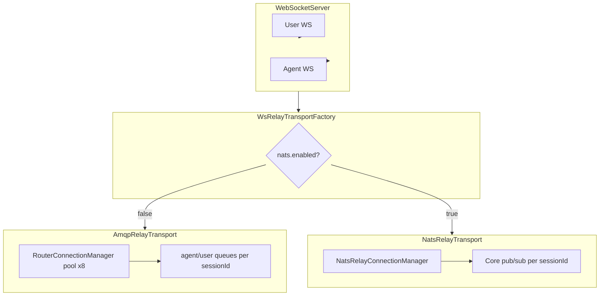
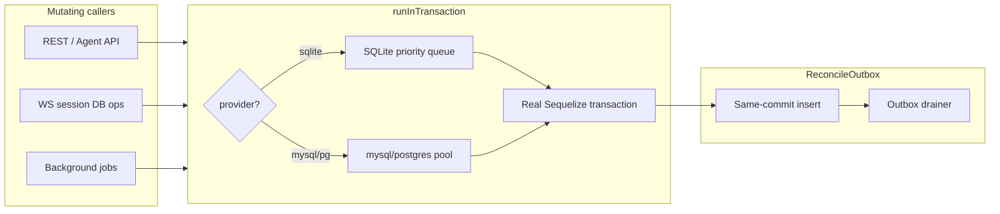

# Controller v3.8 — architecture overview

**Audience:** Platform operators, integrators, and contributors  
**Release:** v3.8.0 · Node **24.x** · **Edgelet only** (no v3.7 legacy field agent)

Controller is the fleet control plane for ioFog / Datasance PoT. It orchestrates **Edgelet** nodes, deploys system microservices (router, NATS, controller), manages applications and workloads, issues certificates, and enforces RBAC for operator APIs.

---

## System context



| Component | Role |
|-----------|------|
| **Controller API** | User RBAC routes (`/api/v3/*`), agent wire protocol (`/api/v3/agent/*`), embedded OIDC issuer (`/oidc` when `AUTH_MODE=embedded`) |
| **EdgeOps Console** | Static SPA served from `EDGEOPS_CONSOLE_PATH`; reads `controller-config.js` written at startup |
| **Edgelet** | Edge runtime and field agent; polls Controller for config, microservices, and change flags |
| **System microservices** | **router** (Skupper-style messaging), **NATS** (MQTT leaf), **controller** (remote ControlPlane on system fogs) — deployed on agents by Edgelet |

**Distribution:** container images only (`ghcr.io/eclipse-iofog/controller`, `ghcr.io/datasance/controller`). Same source tree on both mirrors; CI differs by `IMAGE_REGISTRY` only.

---

## Runtime layout

| Listener | Default port | Env override | Purpose |
|----------|--------------|--------------|---------|
| API | **51121** | `API_PORT` | REST, WebSocket exec/logs, OIDC routes |
| EdgeOps Console | **8008** | `CONSOLE_PORT` | Static operator UI |

Startup sequence (`src/init.js` → `src/server.js`):

1. Load config and OpenTelemetry.
2. Initialize vault (optional) and database.
3. Ensure central router/NATS local CAs.
4. Bootstrap embedded OIDC admin (embedded mode).
5. Register all routes from `src/routes/` and background jobs from `src/jobs/`.
6. Write `EDGEOPS_CONSOLE_PATH/controller-config.js` for the Console SPA.
7. Listen on API and Console ports (HTTP or TLS).

---

## Source modules

| Module | Path | Responsibility |
|--------|------|----------------|
| **Server** | `src/server.js`, `src/init.js`, `src/daemon.js` | Process entry, dual HTTP servers, middleware order, job scheduler |
| **Routes** | `src/routes/*.js` | Declarative HTTP/WebSocket route table (method, path, middleware) |
| **Controllers** | `src/controllers/*.js` | Thin handlers: validate input, call services, shape responses |
| **Services** | `src/services/*.js` | Business logic, change tracking, orchestration |
| **Schemas** | `src/schemas/*.js` | Request/response validation |
| **Data layer** | `src/data/models/`, `managers/`, `migrations/`, `seeders/` | Sequelize persistence (sqlite, mysql, postgres) |
| **Config** | `src/config/` | `config.yaml`, env mapping, OIDC, RBAC resource map, flavor |
| **RBAC** | `src/lib/rbac/`, `src/config/rbac-resources.yaml` | JWT subject extraction, route authorization |
| **Auth** | `src/config/oidc.js`, `src/services/auth-*` | Embedded/external OIDC, BFF, MFA, sessions |
| **Agent API** | `src/routes/agent.js`, `src/services/agent-service.js` | Edgelet field-agent wire protocol (fog token auth) |
| **WebSocket** | `src/websocket/` | Microservice exec and log streaming |
| **Jobs** | `src/jobs/*.js` | Periodic maintenance (status, tokens, NATS reconcile, cleanup) |
| **Certificates** | `src/services/certificate-service.js` | PKI for router/NATS and agent certs |
| **CLI** | `src/cli/` | `iofog-controller` administrative commands |
| **Vault** | `src/vault/` | Optional external secret backends |
| **API spec** | `docs/swagger.yaml` | Canonical OpenAPI for `/api/v3/*` |

---

## API surfaces

Controller exposes two authentication models on the same API port.

### Operator API (OIDC Bearer + RBAC)

Used by EdgeOps Console, `potctl`, `iofogctl`, and automation.

| Area | Route prefix | Notes |
|------|--------------|-------|
| Status & architectures | `/api/v3/status`, `/api/v3/architectures/` | Public status; architecture catalog |
| Agents (ioFog) | `/api/v3/iofog` | Provision keys, agent CRUD, config |
| Applications | `/api/v3/application` | Replaces legacy `/api/v3/flow` |
| Microservices & catalog | `/api/v3/microservices`, `/api/v3/catalog` | Multi-arch `images[]`, service accounts |
| Networking | `/api/v3/router`, `/api/v3/nats`, `/api/v3/tunnel`, `/api/v3/service` | Router/NATS config, TCP bridge |
| RBAC | `/api/v3/roles`, `/api/v3/rolebindings`, … | Kubernetes-style roles |
| Auth & users | `/api/v3/user`, `/api/v3/auth` | Login, OAuth BFF, profile, JWKS rotation |
| Secrets & config | `/api/v3/secret`, `/api/v3/configMap`, `/api/v3/registries` | Fleet configuration |
| Certificates | `/api/v3/certificate` | PKI operations |
| WebSocket | `ws` routes in `src/routes/` | Exec and logs (Bearer token) |

Browser login uses the OAuth BFF (`GET /api/v3/user/oauth/authorize`); CLI uses `POST /api/v3/user/login`. See [oidc-configuration.md](oidc-configuration.md), [external-oidc-client-setup.md](external-oidc-client-setup.md), and [rbac-reference.md](rbac-reference.md).

### Agent API (fog token — no OIDC)

Used by **Edgelet field agents** only. Paths under `/api/v3/agent/*` authenticate with the agent provisioning token, not user JWTs.

| Command family | Examples | Purpose |
|----------------|----------|---------|
| Lifecycle | `POST /agent/provision`, `PUT /agent/status` | Register agent, heartbeat |
| Config | `GET/PATCH /agent/config` | Pull/push agent configuration |
| Workloads | `GET /agent/microservices`, `GET /agent/changes` | Reconcile microservices and change flags |
| ControlPlane | `POST /agent/controller/register` | System fog registers controller MS |
| Supporting | `GET /agent/version`, `GET /agent/volumeMounts`, registries, logs | OTA, mounts, diagnostics |

Full request/response shapes: **`docs/swagger.yaml`** (agent paths).

---

## Background jobs

| Job | File | Role |
|-----|------|------|
| Fog status | `fog-status-job.js` | Mark agents offline when status pings lapse |
| Controller heartbeat | `controller-heartbeat-job.js` | Control-plane liveness |
| Fog token cleanup | `fog-token-cleanup-job.js` | Expire stale agent tokens |
| Controller cleanup | `controller-cleanup-job.js` | Orphaned controller MS housekeeping |
| Event cleanup | `event-cleanup-job.js` | Audit event retention |
| NATS reconcile | `nats-reconcile-worker-job.js` | NATS operator sync |
| Platform reconcile | `platform-reconcile-worker-job.js` | Fog + service platform claim/reconcile (one job, two queues) |
| Fog platform sweep | `fog-platform-sweep-job.js` | Drift detection; re-enqueue stale fog/service tasks |
| Stopped app status | `stopped-app-status-job.js` | Application state maintenance |

### Platform reconcile (fog + service + resolver)

Router/NATS **fog platform lifecycle**, **service endpoint provisioning**, and the existing **NATS resolver** layer are three separate reconcile queues — not fire-and-forget `setImmediate` blocks in `iofog-service.js` / `services-service.js`.



| Layer | Table | Worker | Purpose |
|-------|-------|--------|---------|
| **Fog platform** | `FogPlatformReconcileTasks` | Same job: `claimNextFogTask` | Router/NATS instances, PKI, system MS, **full recompute** of service-derived TCP bridges per fog |
| **Service platform** | `ServicePlatformReconcileTasks` | Same job: `claimNextServiceTask` | Hub connector/listener, K8s Service, ConfigMap (DB lock), fan-out fog tasks on tag change |
| **NATS resolver** | `NatsReconcileTasks` | `nats-reconcile-worker-job.js` | JWT bundles, account/user creds after app deploy |

**Fog operator API:** `GET /iofog/{uuid}` includes optional **`platformStatus`** (`phase`, `generation`, `lastError`); list/get derive `routerMode`/`natsMode` from **`FogPlatformSpecs`** when runtime rows are pending. **`POST /iofog/{uuid}/reconcile`** for manual retry.

**Service operator API:** JSON + YAML create/update/delete enqueue service reconcile; **`provisioningStatus=ready`** marks hub complete (K8s Service + hub ConfigMap); edge listeners converge via fog fan-out. **`POST /services/{name}/reconcile`** for manual retry.

Full spec: [`.cursor/controllerv3.8/docs/15-fog-platform-reconcile.md`](../.cursor/controllerv3.8/docs/15-fog-platform-reconcile.md) · RFC R69–R79.

---

## WebSocket exec & log sessions

Interactive **exec** and **log streaming** use paired WebSocket sessions between operators (Bearer JWT), Controller, and Edgelet agents (fog token). Plan 16 hardens log sessions and shared WS infra (HA, drain, OTEL). **Plan 17** redesigns **microservice exec** to log-style multi-session flow (5 concurrent per MS, agent poll + session-scoped WS). **Plan 18** production-hardens cross-replica relay via **`WsRelayTransport`** — AMQP pool + recovery when `nats.enabled=false`, NATS Core when `nats.enabled=true` (R102–R113). **Edgelet agent wire change required** for exec only (see [edgelet-invariants.md §10.1](../.cursor/controllerv3.8/docs/edgelet-invariants.md)).



```mermaid
sequenceDiagram
  participant U as User WS
  participant C as Controller
  participant DB as MicroserviceExecSessions
  participant CT as Change tracking
  participant R as WsRelayTransport
  participant A as Edgelet agent

  Note over U,A: MS exec (R92–R98) — log-style
  U->>C: WS /microservices/exec/:uuid
  C->>DB: INSERT sessionId PENDING
  C->>CT: execSessions=true
  C->>U: ACTIVATION { sessionId }
  C->>U: STDERR waiting…

  A->>C: GET /changes execSessions
  A->>C: GET /agent/exec/sessions
  A->>C: WS /agent/exec/microservice/:uuid/:sessionId
  C->>DB: ACTIVE agentConnected
  C->>R: enable bridge if cross-replica
  U->>C: STDIN
  C->>R->>A: relay
  A->>C: STDOUT
  C->>R->>U: relay
  U-->>C: close
  C->>DB: DELETE row
  C->>CT: execSessions if needed

  Note over U,A: Fog debug (R99)
  U->>C: POST /iofog/:uuid/exec
  C->>C: provision debug system MS
  U->>C: WS /microservices/system/exec/:debugMsUuid

  Note over U,A: Logs (R82–R83, R84/R112)
  U->>C: WS logs + tail params
  C->>DB: PENDING sessionId
  A->>C: WS agent/logs/:sessionId
  A->>C: LOG_LINE
  C->>R->>U: relay
```

| Topic | Normative value |
|-------|-----------------|
| MS exec entry | **Direct user WS** — no `POST …/microservices/…/exec` (R92, R94) |
| MS exec concurrency | **5** user exec WS per microservice |
| MS exec lifecycle | **Per-session** — close deletes session row only; **no** `execEnabled=false` (R98) |
| MS exec pending / max | **60s** pending for agent; **8h** max active session (Plan 16 carry-over) |
| Agent exec discovery | `GET /agent/exec/sessions` on `execSessions` change flag (R95, R100) |
| Agent exec WS | `/agent/exec/microservice/:uuid/:sessionId` only — legacy `/agent/exec/:uuid` removed (R96) |
| User session notify | **ACTIVATION** (type 5) with `{ sessionId, microserviceUuid }` (R97) |
| Fog debug provision | `POST/DELETE /iofog/:uuid/exec` unchanged; shell via `WS /microservices/system/exec/:debugMsUuid` (R99) |
| Log concurrency | **5** user log WS per microservice (or per fog for node logs) |
| Log limits | Tail max **5,000** lines; **120s** pending; **2h** idle |
| Log content | Live relay only — no log line persistence; audit connect/disconnect |
| HA relay | Cross-replica sessions **require** a **relay backend** (R112): **AMQP** router queues when `nats.enabled=false`; **NATS Core** subjects on hub when `nats.enabled=true`. Same-replica may use direct WS; **fail fast** close **1013** when active backend unavailable |
| Graceful drain | **30s** on SIGTERM / k8s `preStop` — CLOSE frames, queue cleanup, session row delete |
| Security | Agent handlers validate fog token **before** message processing; **50** upgrades/min/IP; **100** active WS/IP; JWT in `?token=` (ingress log redaction required) |
| Scale SLO | **500** concurrent WS per replica; **p99 pairing < 5s** |
| Observability | OpenTelemetry: active/pending sessions, pairing latency, AMQP failures, router connectivity |

**OTEL metric names (R87):** `ws_exec_sessions_active`, `ws_log_sessions_active`, `ws_pending_pairings`, `ws_pairing_duration_ms` (histogram), `ws_amqp_publish_errors`, `ws_router_connected` (gauge). Emitted when `ENABLE_TELEMETRY=true`; see `src/websocket/ws-metrics.js`.

**Relay transport (Plan 18, R102):** Selected once at startup from existing `nats.enabled` / `NATS_ENABLED` — **no new relay env var**. `false` → AMQP pool (8 connections, sticky by `sessionId`); `true` → NATS Core on hub with **`controller`** NATS account. Relay connect is **lazy** — does not block Controller startup.

**HA config (`server.webSocket.ha`):** `crossReplicaRequiresAmqp` (default `true`; semantics: cross-replica requires **active relay backend** per R112), `failFastOnRouterUnavailable` (default `true`; applies to selected backend). Env: `WS_HA_CROSS_REPLICA_REQUIRES_AMQP`, `WS_HA_FAIL_FAST_ON_ROUTER_UNAVAILABLE`. Graceful drain timeout: `server.webSocket.session.drainTimeoutMs` (default **30s**, env `WS_DRAIN_TIMEOUT_MS`).

**Core modules:** `src/websocket/server.js`, `exec-session-manager.js` (Plan 17), `log-session-manager.js`, `ws-relay-transport-factory.js` / `amqp-relay-transport.js` / `nats-relay-transport.js` (Plan 18), `src/services/websocket-queue-service.js`, `src/services/router-connection-manager.js` (Plan 18), `src/services/nats-relay-connection-manager.js` (Plan 18).

**Operator guide:** [operations/ws-sessions.md](operations/ws-sessions.md) — ingress `?token=` log redaction, HTTPS/WSS, multi-replica relay backend (`nats.enabled`), k8s preStop drain, load SLO probe.

Full spec: Plan 16 [logs + shared infra](../.cursor/controllerv3.8/docs/16-ws-exec-log-hardening.md) · Plan 17 [MS exec](../.cursor/controllerv3.8/docs/17-multi-exec-sessions.md) · Plan 18 [WS relay production](../.cursor/controllerv3.8/docs/18-ws-relay-production.md) · RFC R80–R91, R92–R101, R102–R113 · Edgelet contract: [edgelet-invariants.md §10–§10.1](../.cursor/controllerv3.8/docs/edgelet-invariants.md).

---

## Edgelet agent contract (summary)

Controller v3.8 and Edgelet share a **frozen field-agent REST contract** on `/api/v3/agent/*`. The same release train must be deployed together (e.g. Controller `v3.8.0` + Edgelet `v1.0.0-rc.1`). Edgelet maintains the authoritative wire spec; Controller implements the server side.

**Greenfield rules**

- **Edgelet only** — v3.7 legacy field agents are unsupported.
- No read aliases for removed fields (`dockerUrl`, `fogType`, `messageSpeed`, etc.).
- Agent auth stays on **fog tokens**; OIDC applies to user routes only.

**Provision** — `POST /api/v3/agent/provision`

| Field | Semantics |
|-------|-----------|
| `key` | Provisioning key |
| `type` | Architecture code 0–4 (`archId`: auto, amd64, arm64, riscv64, arm) |
| `engine` | `edgelet` \| `docker` \| `podman` → stored as `containerEngine` |

**Config pull** (`GET config`) — must return `containerEngineUrl`, `pruningFrequency`, `watchdogEnabled`, and fleet keys Edgelet expects. Do **not** return `dockerUrl` or `dockerPruningFrequency`.

**Config push** (`PATCH config`) — Edgelet pushes agent-local overrides using canonical keys (`containerEngineUrl`, `pruningFrequency`, `networkInterface`, …).

**Status** (`PUT status`) — required keys include `daemonStatus`, resource usage, `microserviceStatus`, `version`, `tunnelStatus`, and v3.8 additions:

| Added (v3.8) | Removed (v3.8) |
|--------------|----------------|
| `availableRuntimes` | `processedMessages` |
| `runtimeAgentPhase` (optional) | `messageSpeed` |
| `controlPlaneQuiesced` (optional) | `microserviceMessageCounts` (do not persist) |

**Change flags** — unchanged names: `deleteNode`, `reboot`, `config`, `version`, `registries`, `prune`, `volumeMounts`, `microserviceConfig`, `microserviceList`, `execSessions`, `tunnel`, `microserviceLogs`, `fogLogs`.

**Microservice list** (`GET microservices`) — each entry includes derived flags `isRouter`, `isNats`, and DB-backed **`isController`** for the system controller microservice.

**Controller MS register** — `POST /api/v3/agent/controller/register` (system fogs only, beta.1+ Edgelet):

- Auth: agent fog token; `fog.isSystem === true`.
- Body: Edgelet-generated `uuid`, `images[]`, `registryId`, optional `ports`, `env`, `volumeMappings`.
- Server upserts MS with `isController: true` in application `system-{fogName}`; returns `{ "uuid": "..." }`.
- User `DELETE` / `PATCH` on controller MS → **403** / **400**; operator system PATCH allowed.

**Volume mounts** — `GET volumeMounts` returns bind/volume shapes plus system-injected immutable `serviceAccount` entries.

**Service account RBAC** — microservice roles use apiGroup **`edgelet.iofog.org/v1`**; SA/role changes trigger `microserviceList` change tracking.

For the full bilateral contract (including ControlPlane env vars and verification references), see Edgelet documentation:

- [Edgelet README / docs](https://github.com/eclipse-iofog/edgelet/blob/main/docs/edgelet/README.md)
- Edgelet mirror of this contract: `controller-invariants.md` in the [eclipse-iofog/edgelet](https://github.com/eclipse-iofog/edgelet) repository

---

## Data and PKI

| Topic | v3.8 behavior |
|-------|---------------|
| **Database** | Greenfield v3.8.0 schema — **new install only** (no v3.7 migrator). Supports **sqlite** (single-controller production), **mysql**, and **postgres** (multi-replica / HA). All mutating paths use **`runInTransaction()`** (Plan 19, R114–R125). Plan **19-I** stabilization (R126–R135): unified ALS transaction context, phased NATS reconcile, grep gates, first-fog integration SLO. |

### Database profiles (Plan 19 / 19-I)

| Profile | Database | Controller replicas | Typical fleet size | Notes |
|---------|----------|---------------------|-------------------|-------|
| **Edge / PoT** | sqlite | 1 | ≤ **50** fogs (default warning threshold) | Single write queue; embedded OIDC |
| **Small production** | sqlite | 1 | 50–100 fogs | Supported within single-writer physics; soft warning logged above threshold |
| **Enterprise / HA** | mysql or postgres | 1+ | **100+** fogs recommended | Default for large fleets; `FOR UPDATE SKIP LOCKED` task claims; shared OIDC session store |

**Enterprise default:** mysql/postgres for fleets above **100** fogs or any multi-replica deployment. sqlite remains supported for single-node edge deployments within Plan 19 SLOs (200 fogs acceptance profile).



| Priority lane | Callers |
|---------------|---------|
| **interactive** | Agent routes, user RBAC API, WS session DB ops, OIDC/auth |
| **background** | Reconcile workers, outbox drainer, platform sweep, cleanup timers |

Full operator runbook: [operations/database-transactions.md](operations/database-transactions.md).

### SQLite single-node production

Small deployments with **one Controller process** may use SQLite as the production database (embedded OIDC requires a single replica in this profile).

| Topic | Behavior |
|-------|----------|
| **When to use** | Single Controller, no DB HA requirement, edge/small-cluster PoT (≤ recommended fog count) |
| **Write path** | All mutations via `runInTransaction()` — **real** ACID transactions (no `fakeTransaction`); nested reuse via **`runWithTransactionContext`** ALS (R126–R128) |
| **Concurrency** | Global **priority write queue** (interactive before background); pool `max: 1`; WAL + `busy_timeout` pragmas |
| **First-fog SLO (R133)** | sqlite integration gate: first fog reconcile + concurrent operator login/list **< 2s**; `RUN_INTEGRATION=1 npm run test:integration:first-fog` |
| **Load close gate (R135)** | `node test/load/transaction-safety-load.js --fogs=50 --soak-minutes=5` — agent p99 &lt; 200ms, operator p99 &lt; 1s |
| **Busy retry** | Exponential backoff + jitter on `SQLITE_BUSY` inside queue task (configurable max attempts) |
| **Reconcile enqueue** | **`ReconcileOutbox`** — mutation + outbox row in same commit; drainer creates reconcile tasks |
| **Background jobs** | `priority: 'background'`; startup stagger (`settings.jobStartupDelaySeconds`, default 3s) + 500ms between jobs |
| **Task claims** | Same runner; busy retry on sqlite; mysql/postgres use `FOR UPDATE SKIP LOCKED` |
| **Load SLO** | 200 fogs / 40s poll / 10 operators / 30 min soak: agent poll p99 **< 200ms**; operator REST p99 **< 1s** |
| **Persistence** | Mount a persistent volume for `controller_db.sqlite` and WAL sidecar files (`-wal`, `-shm`) |
| **Backup** | Use SQLite backup API or copy DB + WAL files during a quiet window |
| **HA path** | mysql/postgres + multiple Controller replicas — see [oidc-configuration.md](oidc-configuration.md) |
| **Applications** | Table `Applications` (was `Flows`); API identity by **name** string. |
| **Architectures** | Table `Architectures` (was `FogTypes`); `archId` 0–4. |
| **PKI** | Central **default-router-local-ca** and **default-nats-local-ca** for all new agents; no per-agent local CAs on provision (greenfield — no v3.7 PKI migration job). See [pki.md](pki.md). |
| **TCP bridge** | Connector `host` depends on target agent **router mode** and service type. **Router required** (`routerMode` ≠ `none`) for `microservice` and `agent` services. **Interior** router: `127.0.0.1` (router runs host-network; bridge is reached via localhost). **Edge** router: `edgelet.default.svc.bridge.local` for host-network microservices and `agent` services; `{appName}.{microserviceName}` for pod-network microservices. Reserved ports **54321**, **54322**, **53**. |

---

## Authentication modes

| Mode | When | Issuer |
|------|------|--------|
| **Embedded** | `AUTH_MODE=embedded` | In-process OIDC at `{CONTROLLER_PUBLIC_URL}/oidc` |
| **External** | `AUTH_MODE=external` | Third-party IdP via `OIDC_ISSUER_URL` |

Embedded mode bootstraps an admin from `OIDC_BOOTSTRAP_ADMIN_*` env vars on first start. External mode uses the OAuth BFF for browser login; CLI retains password + TOTP via `POST /api/v3/user/login`. Full env reference: [oidc-configuration.md](oidc-configuration.md).

Agent routes and WebSocket exec/logs for agents are **outside** OIDC — see [rbac-reference.md](rbac-reference.md) for which user routes are public or agent-scoped.

---

## Related operator docs

| Document | Topic |
|----------|-------|
| [README.md](../README.md) | Install, quick start, Edgelet pin |
| [CHANGELOG.md](../CHANGELOG.md) | v3.8.0 breaking changes |
| [swagger.yaml](swagger.yaml) | HTTP API reference |
| [rbac-reference.md](rbac-reference.md) | Roles, bindings, route map |
| [pki.md](pki.md) | Central CAs, cert renewal, NATS operator rotation |
| [oidc-configuration.md](oidc-configuration.md) | Embedded/external auth modes and env vars |
| [external-oidc-client-setup.md](external-oidc-client-setup.md) | External IdP client configuration |
| [operations/database-transactions.md](operations/database-transactions.md) | Transaction runner, OTEL metrics, SQLITE_BUSY runbook |
| [CONTRIBUTING](../CONTRIBUTING) | Dual-mirror CI and development |
