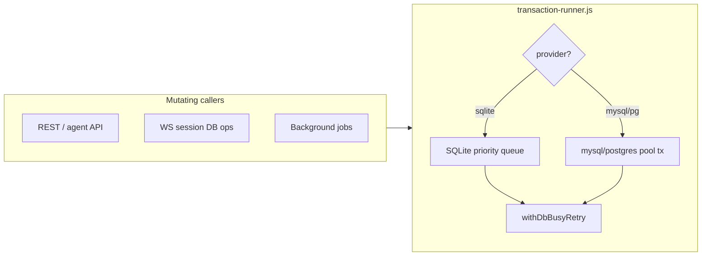

# Database transactions — operations guide

## Overview

Controller v3.8.0 routes **all mutating database work** through `runInTransaction()` in `src/helpers/transaction-runner.js`. Every commit uses a **real** Sequelize transaction — the legacy `fakeTransaction` workaround is removed.

| Provider | Concurrency model |
|----------|-------------------|
| **sqlite** | Single connection (`pool.max: 1`); global **priority write queue** (interactive before background); WAL + `busy_timeout` |
| **mysql / postgres** | Connection pool (default max **10**); task claims use `FOR UPDATE SKIP LOCKED` |

Reconcile work is scheduled via the **`ReconcileOutbox`** table — mutations and outbox inserts commit atomically; a background drainer creates reconcile task rows.

---

## Architecture



**Priority lanes (sqlite only):**

| Priority | Typical callers |
|----------|-----------------|
| **interactive** | Agent routes, RBAC API, WS session DB ops, OIDC/auth |
| **background** | Reconcile workers, outbox drainer, platform sweep, heartbeat, cleanup jobs |

Interactive tasks are dequeued before background tasks. mysql/postgres skip the global queue and use the connection pool directly.

### Unified transaction context

Routed all writes through `runInTransaction()`, but **`generateTransaction` handlers that received an explicit Sequelize `transaction` argument did not register that transaction in AsyncLocalStorage (ALS)**. Any nested callee that called `runInTransaction()` without the parent tx could enqueue a **second** sqlite writer → deadlock (`SQLITE_BUSY`, API hang ~30–60s).

| Mechanism | Role |
|-----------|------|
| **`runWithTransactionContext(transaction, priority, fn)`** | Runs `fn` with ALS set to the **existing** transaction — required whenever code already holds a Sequelize tx |
| **`generateTransaction`** | Uses `runWithTransactionContext` for explicit-tx args, ALS parent injection, and new top-level txs via `runInTransaction` |
| **`runInTransaction()` (no tx arg)** | Reuses parent tx from ALS when nested under any ancestor that used `runWithTransactionContext` (**interactive** priority only on SQLite) |
| **`runInTransaction({ priority: background })`** | Always enqueues a **fresh** SQLite transaction — never reuses ALS parent (avoids stale tx after handler commit + deferred audit) |

**Rule for developers:** If your function runs inside an open transaction (API handler last arg, worker phase callback, etc.), nested work must either pass `transaction` through wrapped exports **or** rely on ALS via `runWithTransactionContext`. Do not call bare `runInTransaction()` from deep helpers expecting implicit join — the runner only reuses via ALS or an explicit tx parameter on `runInTransaction` itself.

Phased reconcile and grep gates complement ALS: short txs for NATS/platform phases and CI checks for K8s/vault/I/O outside tx bodies.

---

## When to use which database

| Profile | Recommended DB | Notes |
|---------|----------------|-------|
| Single Controller, ≤ **50** fogs (default threshold) | **sqlite** | Edge / PoT; mount persistent volume for `.sqlite` + `-wal` / `-shm` |
| Single Controller, **50–100+** fogs | **mysql** or **postgres** | Controller logs soft warning above threshold on sqlite |
| Multi-replica HA | **mysql** or **postgres** | Embedded OIDC requires shared DB; sqlite **not** supported for multi-replica |
| Enterprise production | **mysql** or **postgres** | Documented default for large fleets and multi-user load |

| Fleet size | sqlite | mysql/postgres |
|------------|--------|----------------|
| ≤ 50 fogs | Recommended | Optional |
| 51–100 fogs | Supported with warning | Recommended |
| 100+ fogs | Possible but not recommended | **Required** for enterprise SLOs |
| Multi-replica | Not supported | **Required** |

---

## Configuration

| Setting | Default | Env override |
|---------|---------|--------------|
| `settings.sqliteEnterpriseFogWarningThreshold` | 50 | `SQLITE_ENTERPRISE_FOG_WARNING_THRESHOLD` |
| `settings.dbWriteQueueMaxDepth` | 256 | `DB_WRITE_QUEUE_MAX_DEPTH` |
| `settings.dbWriteQueueBackpressureDepth` | 32 | `DB_WRITE_QUEUE_BACKPRESSURE_DEPTH` |
| `settings.dbTransactionTimeoutReadinessMs` | 5000 | `DB_TRANSACTION_TIMEOUT_READINESS_MS` |
| `settings.dbTransactionTimeoutInteractiveMs` | 15000 | `DB_TRANSACTION_TIMEOUT_INTERACTIVE_MS` |
| `settings.dbTransactionTimeoutBackgroundMs` | 120000 | `DB_TRANSACTION_TIMEOUT_BACKGROUND_MS` |
| `settings.dbBusyRetryMaxAttempts` | 8 | `DB_BUSY_RETRY_MAX_ATTEMPTS` |
| `settings.dbBusyRetryBaseMs` | 25 | `DB_BUSY_RETRY_BASE_MS` |
| `settings.reconcileOutboxDrainerIntervalSeconds` | 1 | `RECONCILE_OUTBOX_DRAINER_INTERVAL_SECONDS` |
| `database.mysql.pool.max` | 10 | *(yaml only)* |
| `database.postgres.pool.max` | 10 | *(yaml only)* |

See `src/config/config.yaml` and [architecture.md](../architecture.md) for pool and pragma settings.

---

## SQLite write queue backpressure

When total queued work (`interactive` + `background` lanes) exceeds `settings.dbWriteQueueBackpressureDepth` (default **32**), **new background enqueue attempts are rejected** with `QueueBackpressureError` (503 to callers when surfaced through agent auth). Interactive work continues to enqueue and drain in priority order.

When depth exceeds `settings.dbWriteQueueMaxDepth` (default **256**), Controller logs an **error** once per overflow episode. Interactive requests are still not rejected at the alert threshold — operators should investigate background job pressure or migrate to mysql/postgres.

### Self-recovery (SQLite)

| Layer | Trigger | Action |
|-------|---------|--------|
| **L1 timeout** | Transaction exceeds lane timeout | Reject with `TransactionTimeoutError`; worker continues |
| **L2 pool recycle** | After interactive/background timeout | Close and re-init sqlite connection pool |
| **L3 queue surgery** | 3+ interactive timeouts in 60s **or** backpressure sustained 30s | Shed all queued background tasks with `QueueBackpressureError` |

Readiness probes (`SELECT 1` for `/api/v3/status`) run **outside** the global write queue on SQLite so health checks stay responsive when the queue is wedged. Timeout defaults to `dbTransactionTimeoutReadinessMs` (5s); failures return **503** with `Retry-After`.

---

## OTEL metrics

Instruments are registered at startup in `src/helpers/db-metrics.js` (requires `ENABLE_TELEMETRY=true`).

| Metric | Type | Labels | Suggested alert |
|--------|------|--------|-----------------|
| `db.transaction.duration` | histogram | `label`, `priority`, `provider` | p99 spike correlated with load |
| `db.write_queue.depth` | gauge | `priority` | **> 100 for 5 min** → investigate background pressure |
| `db.write_queue.wait_ms` | histogram | `priority` | Sustained high wait → scale DB or reduce background load |
| `db.transaction.timeouts` | counter | `label`, `priority` | **Any sustained rate** → stuck tx or load spike |
| `db.write_queue.background_shed` | counter | `reason` | **Any increment** → queue surgery fired; check stuck writers |
| `db.busy_retries` | counter | `label` | **> 10/min** → lock contention |
| `db.connection.invalidated` | counter | `provider` | **Any increment** → investigate pool / connection errors |
| `db.sqlite.fog_count_warning` | counter | — | Fleet exceeded sqlite recommended size |

### Alert thresholds (summary)

1. **`db.write_queue.depth` > 100 for 5 minutes** — background jobs or agent poll load saturating the sqlite serializer; check reconcile worker intervals and fog count.
2. **`db.busy_retries` rate > 10/minute** — sqlite lock contention; verify WAL mode and consider mysql/postgres.
3. **`db.connection.invalidated` any increase** — connection pool error or mid-transaction kill; check DB connectivity and replica health.
4. **`db.sqlite.fog_count_warning` any increase** — migrate to mysql/postgres for enterprise scale.

---

## Troubleshooting

### SQLITE_BUSY / "cannot rollback - no transaction is active"

Caused by competing raw transactions (jobs, WS cleanup) vs fakeTransaction API path.

Should be rare — busy retry with exponential backoff and a single priority queue serialize writes. If persistent:

1. Check `db.write_queue.depth` and `db.busy_retries`
2. Confirm WAL mode: `PRAGMA journal_mode` → `wal`
3. Verify no long-running transaction (K8s and external I/O must run outside open transactions)
4. **Migrate to mysql/postgres** if fog count > threshold

### Reconcile tasks not running

1. Check `ReconcileOutbox` for rows with `processedAt IS NULL`
2. Verify outbox drainer job is running (logs on startup)
3. Check drainer `lastError` column

### HA double reconcile (mysql/postgres)

Should not occur with SKIP LOCKED claims. If observed, capture concurrent worker logs and verify  claim tests pass.

### API hangs ~60s then SQLITE_BUSY (SQLite)

Typical on **`pool.max: 1`** when two writers compete for the single connection.

| Symptom | Likely cause | Fix |
|---------|--------------|-----|
| Hang during **first fog create** / platform reconcile / **provisioning-key** (post-19-I-A) | Nested `runInTransaction()` without ALS parent (legacy explicit-tx path) or monolithic reconcile tx | Verify deployed: ALS via `runWithTransactionContext`; NATS phased txs; run `RUN_INTEGRATION=1 npm run test:integration:first-fog` |
| Hang during **first fog create** / platform reconcile / **provisioning-key** (pre-19-I) | Nested `generateTransaction`: wrapped callee called **without** `transaction` last arg (e.g. `SecretService.getSecretEndpoint(name)` inside `certificate-service.js`) | Pass parent `transaction` through all wrapped service calls; grep `certificate-service.js` for SecretService calls |
| **`SQLITE_BUSY`** on idle timer (JTI cleanup) | Job/manager raw Sequelize write bypassing `runInTransaction` | Route through `runInTransaction(..., { priority: 'background' })` |
| Hang on **OAuth interaction** login/MFA | OIDC adapter read/write while outer API tx holds connection | Mirror `auth-interaction-service.complete()`: adapter I/O **before** short DB tx |
| External IdP **login/refresh** slow under load | HTTP inside `generateTransaction` wrapper | External-mode HTTP outside tx; embedded DB paths unchanged |
| Hang on fog **NATS mode change** / fog delete (K8s CP) | Monolithic `ensureNatsForFogDb` held sqlite writer for seconds (certs + auth + mounts in one tx) | — split into `nats.ensure.certPrep` + `nats.ensure.authPrep` + `nats.ensure.topology` short txs; K8s via post-tx external helpers |
| Hang on **nats-reconcile-worker** | JWT bundle K8s patch inside reconcile tx | R-06 phased split — DB reconcile tx then external ConfigMap patch |
| Hang on **secret/configmap/registry** CRUD (vault enabled) | `SecretHelper` vault HTTP inside open Sequelize tx |— internal encrypt in tx; vault store/delete via `transaction.afterCommit` |

**Rule:** When caller already has `transaction`, every wrapped export must receive it as the **last argument** (`generateTransaction` reuses parent tx when `lastArg instanceof Transaction`).

### Vault I/O outside transactions

When HashiCorp Vault is enabled, secret/configmap/registry mutations must not perform vault HTTP while a Sequelize transaction holds the sqlite connection.

| Operation | In transaction | After commit |
|-----------|----------------|--------------|
| Create / update | Store **internal** encryption (or plaintext vault ref if already promoted) | `storeInVaultAndGetReference` + short DB patch to vault ref |
| Delete | DB row + FK cleanup | `SecretHelper.deleteSecret` |

Helpers live in `src/helpers/vault-transaction-helper.js` (`scheduleVaultDeleteAfterCommit`, `scheduleVaultPromoteAfterCommit`). Model `beforeSave` hooks defer vault when `options.transaction` is set. Failures in deferred vault work are logged; committed DB state is not rolled back (orphan vault secrets are preferable to orphan DB rows).

Without vault (`vaultManager.isEnabled()` false), behavior is unchanged — internal encryption only.

---

## Enforcement 

Mechanical **grep gates** in `test/src/helpers/transaction-grep-gates.test.js` fail CI when transaction regressions reappear. Run:

```bash
nvm use 24
npm test -- --grep "grep gates"
```

| Gate | What it checks |
|------|----------------|
| **fakeTransaction** | Zero hits anywhere under `src/` |
| **bypassQueue** | Zero hits anywhere under `src/` |
| **sequelize.transaction** | Allowed only in `transaction-runner.js` |
| **Managers never enqueue** | Zero `runInTransaction` in `src/data/managers/` — managers accept `transaction` from callers only |
| **Certificate tx propagation** | `certificate-service.js` passes `transaction` to every `SecretService.getSecretEndpoint` call |
| **Cert utils branch** | `src/utils/cert.js` — `loadCA` / `getCAFromK8sSecret` branch on `transaction ?` before nested `runInTransaction`; `getCAFromInput` forwards `transaction` |
| **K8s outside tx (nats-service)** | DB helpers (`ensureNatsForFog*Db`, `cleanupNatsForFogDb`, `_reconcileResolverArtifactsOnceDb`) contain no `K8sClient` — K8s via external helpers after commit |
| **K8s outside tx (service-platform-service)** | Labeled `servicePlatform.*` tx blocks contain no `K8sClient` — hub router / LB sync via `applyK8sHubRouterPlan`, `reconcileK8sServiceExternal`, etc. |
| **Vault outside tx** | Secret/configmap/registry delete paths use `scheduleVaultDeleteAfterCommit` / `scheduleVaultPromoteAfterCommit`, not inline vault HTTP |
| **Volume-mount associations** | Sequelize `{ transaction }` inside association options, not as a trailing positional arg |
| **Fog platform phased reconcile** | Separate `fogPlatform.*` labels; no monolithic `fogPlatform.natsEnsure` |
| **OIDC adapter** | All adapter reads/writes through `runInTransaction` with `oidc.adapter.*` labels |
| **JTI cleanup** | `fog-token-cleanup-job.js` routes through `runInTransaction`, not bare manager call |
| **Agent auth ALS** | `checkFogToken` runs the handler inside `runWithTransactionContext` so nested `runInTransaction` reuses the auth tx |

When a gate fails, fix the **minimal** violation (pass parent `transaction`, move I/O outside the tx body, or split phases) — do not disable the gate.

### OIDC provider adapter (R-16)

`src/data/adapters/oidc-provider-adapter.js` routes all `AuthOidcProviderState` reads/writes through `runInTransaction` with **interactive** priority (background for expiry purge). OAuth BFF interaction handlers in `auth-interaction-service.js` keep adapter I/O outside short user DB transactions. Do not call adapter methods from inside another open `runInTransaction` body.

### Certificate / secret propagation checklist

When calling from within `reconcileFog`, `_handleRouterCertificates`, or any open transaction:

- `CertificateService.*` → internal `SecretService.*` must pass `transaction`
- `storeCA` / `generateCertificate` in `src/utils/cert.js` must pass `transaction` to `SecretService.createSecretEndpoint`

---

## Backup notes

- **sqlite:** Back up the database file **and** `-wal` / `-shm` sidecars together, or checkpoint WAL before copy.
- **mysql/postgres:** Use standard provider backup tools; ensure migrations are at v3.8.0 before restore.

---

## Related docs

- [architecture.md](../architecture.md) — data layer overview
- [oidc-configuration.md](../oidc-configuration.md) — HA session store requires mysql/postgres

---
